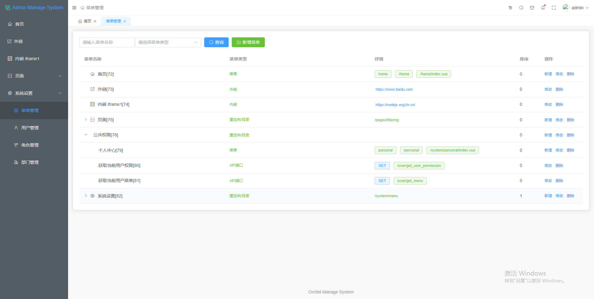
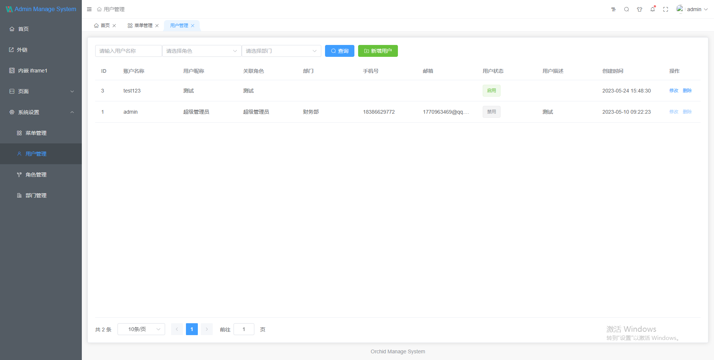
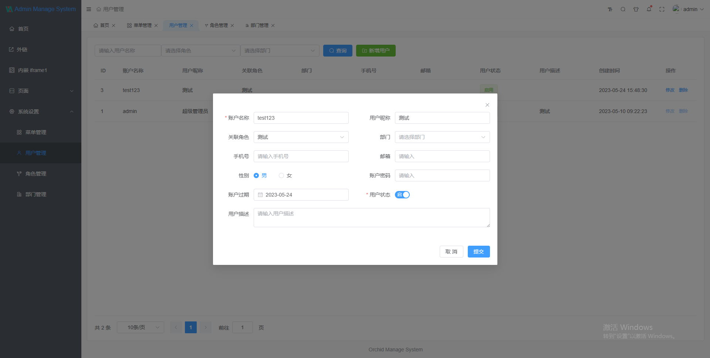
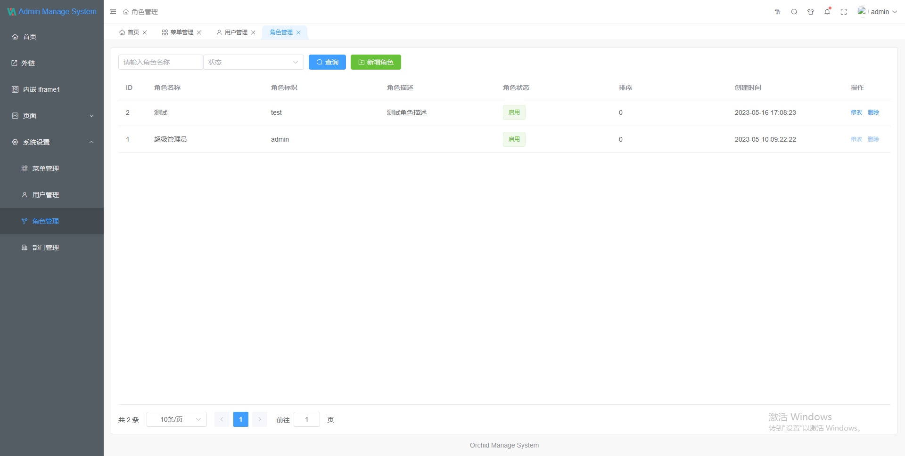
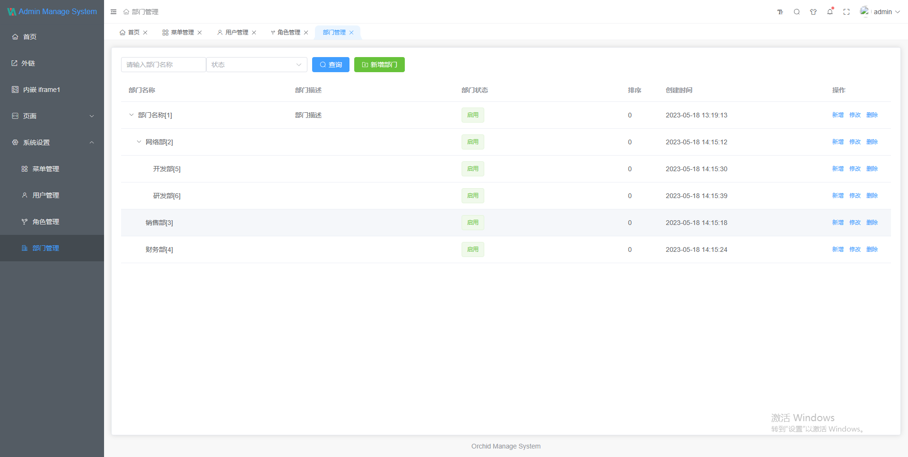

# orchid-admin-vue3

[orchid admin](https://github.com/orchid-admin) 的前端实现，基于 vue3-next-admin(version:2.4.33) 修改

## vue3-next-admin

地址: <a href="https://gitee.com/lyt-top/vue-next-admin.git">gitee</a>

文档：<a href="https://lyt-top.gitee.io/vue-next-admin-doc-preview" target="_blank">vue-next-admin-doc</a>

## 截图

